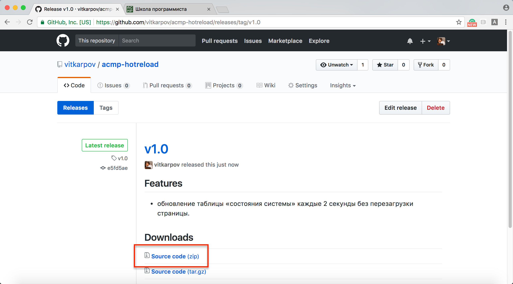

# ACMP.ru Hot Reload

**DEPRECATED** **Функционал поддержан на acmp.ru** **DEPRECATED**

🔥 Для тех, кто устал перезагружать страницу с тестами в ожидании своих результатов 🔥

Результаты в таблице обновляется каждые 2 секунды без перезагрузки страницы. Расширение работает только на странице «Состояние системы».

## Как установить

1. Скачиваем расширение (`acmp-hotreload.zip`) на [странице последнего релиза](https://github.com/vitkarpov/acmp-hotreload/releases) и распаковываем его;
2. Набираем `chrome://extensions` в строке браузера;
3. Выбираем `Developer mode`;
4. Нажимаем `Load unpacked extension...` и выбираем распакованный архив.

## Не работает?

1. Откройте консоль браузера (F12 под Windows, Cmd+Alt+I под MacOS);
2. Следуйте инструкциям в консоли ↓.

